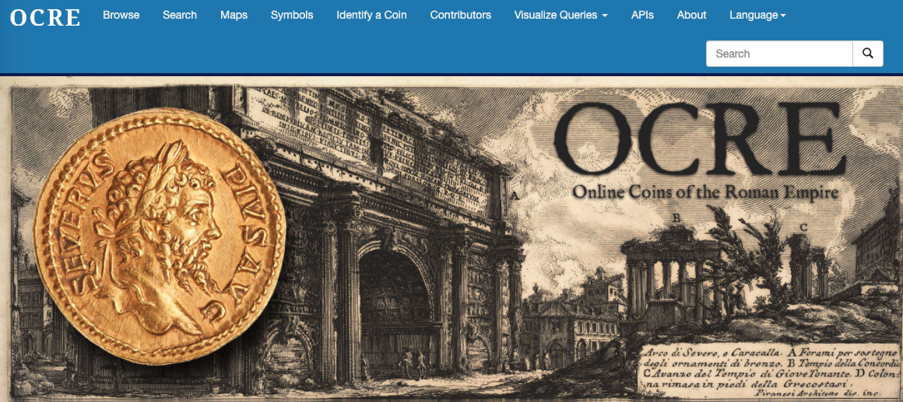

# Tweeting in Roman Imperial Coin Legends

> Thomas Martin, Thomas Posillico, Neel Smith
>
> College of the Holy Cross

---

OCRE 

---

*but ALSO*...

- openly licensed, available for download in defined format

---

## Tweeting?

- frequency of issues: can't be explained in fiscal terms
- text: lengths
- widely circulated texts
- official, sanctioned contents

---

## Overview

Approach:  open license, defined format not limited to OLD environment

Look at timing of issues:

Look at *variety* of texts:  histo of normalized texts

Look at *libertas*

Look at dedicatory formulas

---

## Time of issues

> Question:  who strikes when?

- graph over time of # of issues

---

## Messages on issues

- graph of *distinct obv/rev legends* over time (by emperor?)

---

## Preparing a corpus

- enforce orthography
- expand abbreviations
- develop morphological parser

---

<blockquote>libertas pontifex maximvs tribvnicia potestate XIII imperator VIII consvl V pater patriae
</blockquote>
<pre>LIBERT P M TR P XIII IMP VIII COS V P P
</pre>

---

MD link:

---

## Morphological search

> libertas

---

Conclusion:  not just active search  for specific content, but exploration of multidimensional data using variety of instruments
