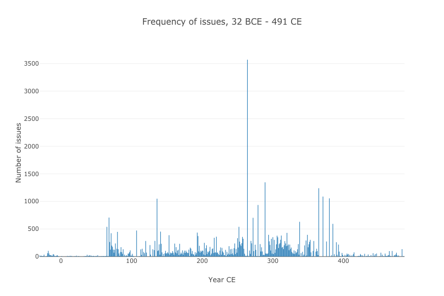
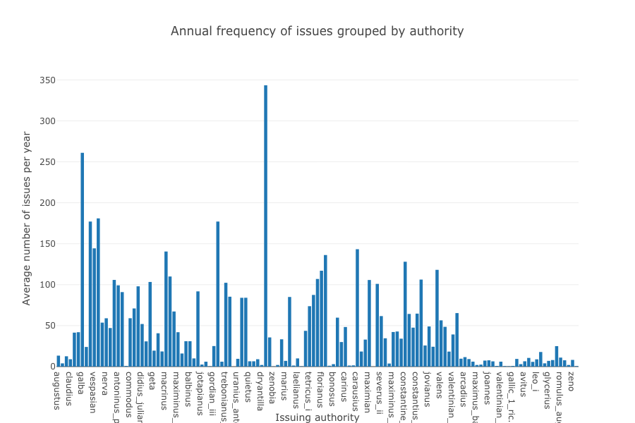
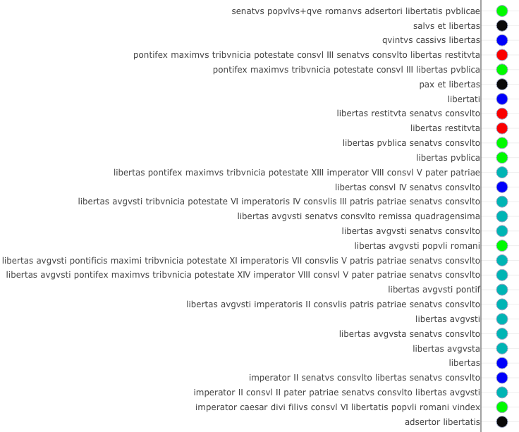

# Tweeting in Roman Imperial Coinage

### Thomas Martin, Thomas Posillico, Neel Smith

#### College of the Holy Cross

---

---

## *OCRE*: a familiar resource on the Web

---

## But *also* a downloadable dataset

<!-- note

Total number of issues in OCRE: 50644
Obv legends: 50148
Rev legends: 48418
All legends: 98566

-->

---

## Crucial features

- openly licensed
- defined data structure
- stable identifiers

---

## Apply computational tool of your choice

- geographic information system
- statistical packages
- natural language analysis

---

## Tweeting?

Official, sanctioned  texts:

- frequent
- widely circulated
- terse

<!-- note

Average annual rate of striking: 96.64886 issues per year

Total characters: 2144309
Average number of characters per legend: 21

Number of datable issues: 50613
Chronological range of issues in OCRE: 32 BCE - 491 CE

-->

---

### Frequent

- 97 issues per year
- ~ every 4 days for 500 years!

---

### But varies by authority

---

### Widespread

---

## Tweet-like texts

- average text ~ 21 characters
- limited vocabulary
  - e.g., RIC 1-3: only 424 distinct tokens!
- highly abbreviated
  - e.g. `R XL` = *remissae quadragensimae* (LOL)

---

## Building a text corpus

---

#### **Diplomatic transcription** (from RIC)

`LIBERT P M TR P XIII IMP VIII COS V P P`

#### **Expanded and normalized version**

libertas pontifex maximvs tribvnicia potestate XIII imperator VIII consvl V pater patriae

---

## Standard orthography

23 alphabetic and 4 punctuation characters:

> `ABCDEFGHIKLMNOPQRSTVXYZ -•←|`

---

## An example: `libertas`

Expanded corpus resolves:

- orthographic ambiguity (`LIB` = `libertas` or `1iberalitas`?)
- morphological ambiguity (nom., gen., dat. all appear)

---

---

---

---

---

---

---

## Context

- legends of more than 200 issues refer to `libertas`
- 29 distinct legends

---

---

---

---

## Concluding observations

  

    

    <strong>beyond search</strong> → exploration of multidimensional data using variety of instruments
    

    

    <strong>replicable scholarship</strong> → all analyses available online
    

  

---

# Thank you!

Slides and further links:

<http://neelsmith.info/current-projects/tweeting/aha/>

<figure>

<figcaption>
  

</figcaption>
</figure>

---
