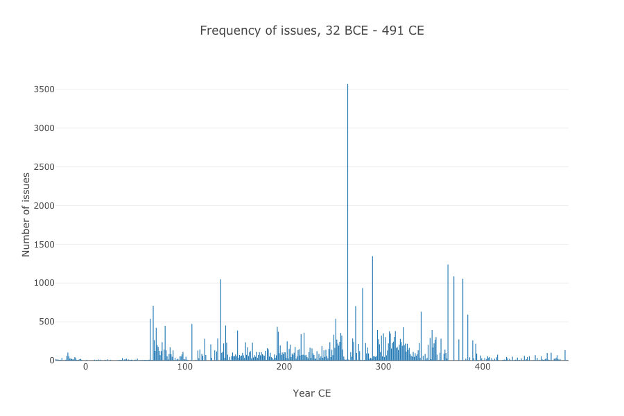
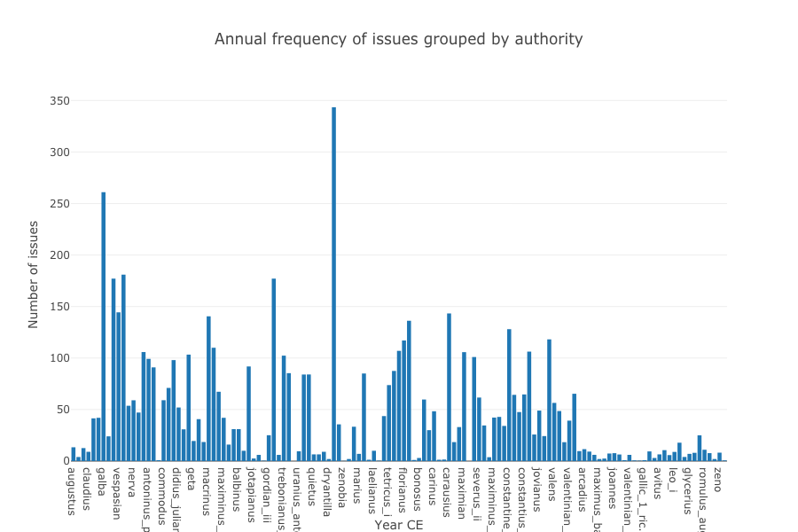
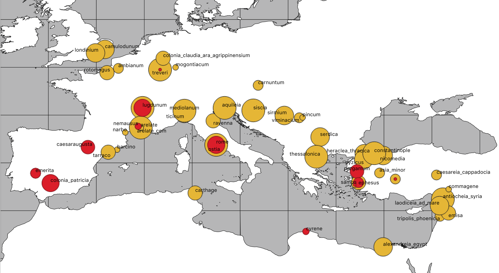
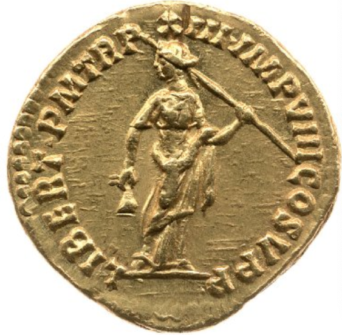
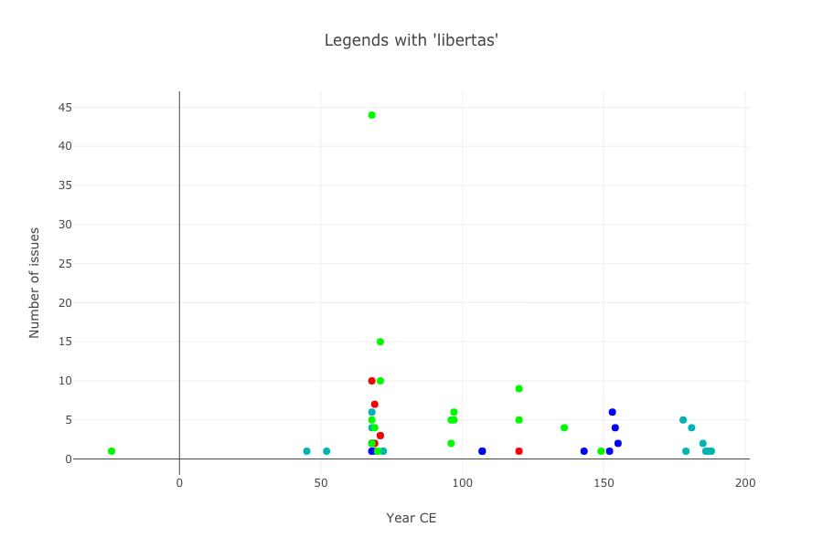

# Tweeting in Roman Imperial Coinage

### Thomas Martin, Thomas Posillico, Neel Smith

#### College of the Holy Cross

---

*OCRE*: a familiar resource on the Web

---

## But *also* a downloadable dataset

- openly licensed
- defined data structure
- stable identifiers

<!-- note

Total number of issues in OCRE: 50644
Obv legends: 50148
Rev legends: 48418
All legends: 98566

-->

---

## Apply computational tool of your choice

- geographic information system
- statistical packages
- natural language analysis

---

## Tweeting?

Official, sanctioned  texts:

- frequent
- widely circulated
- terse

<!-- note

Average annual rate of striking: 96.64886 issues per year

Total characters: 2144309
Average number of characters per legend: 21

Number of datable issues: 50613
Chronological range of issues in OCRE: 32 BCE - 491 CE

-->

---

### Frequent

- 97 issues per year
- ~ every 4 days for 500 years!

---

### But varies by authority

---

### Widespread

---

## Tweet-like texts

- average text ~ 21 characters
- limited vocabulary
- highly abbreviated (LOL)

---

## Building a text corpus

---

#### **Diplomatic transcription** (from RIC)

`LIBERT P M TR P XIII IMP VIII COS V P P`

#### **Expanded and normalized version**

libertas pontifex maximvs tribvnicia potestate XIII imperator VIII consvl V pater patriae

---

## Standard orthography

23 alphabetic and 4 punctuation characters:

> `ABCDEFGHIKLMNOPQRSTVXYZ -•←|`

---

## An example: `libertas`

---

<figure class="alignright">

<figcaption>
  

</figcaption>
</figure>

---

# Thank you!

Slides and further links:

<http://neelsmith.info/current-projects/tweeting/aha/>

---

## Factoids

## Tweeting in Roman Imperial Coin Legends

----

- nomisma.org and open data
    - open licenses, defined format, stable identifiers
- phenomenon of "tweeting":
    - distribution of issues over time
    - limited length of text messages
- making a text corpus
    - citable with CTS URNs
    - specified orthography
    -  developing a parallel version with expanded text (in a different specified orthography)
    - morphologically parsing expanded text

---

The RDF download from November, 2019, included 51267 records. 50645 of them were unique records. 50644 of them were unique, non-empty records.

---

---

Percent of character occurrences of 25 characters above threshhold: 99.824234
Percent of character occurrences of 66 characters below threshhold: 0.17576759

---

Sheep: 95163 (96.54749% of 98566)
Goats: 3403 (3.452509% of 98566)

---

# Conclusion

not just active search  for specific content, but exploration of multidimensional data using variety of instruments

---

# Thank you!

<http://neelsmith.info/current-projects/tweeting/aha/>
