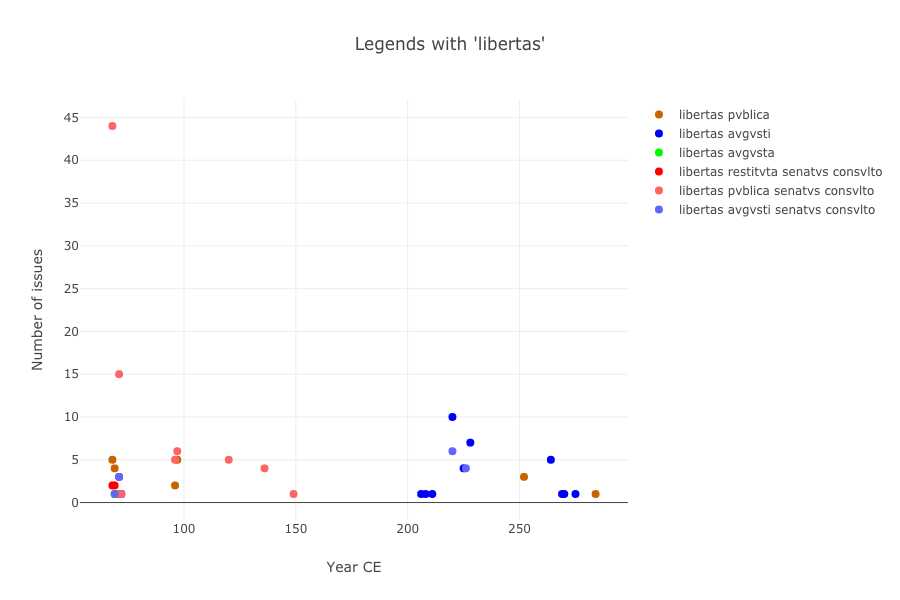

# Tweeting in Roman Imperial Coinage

### Thomas Martin, Thomas Posillico, Neel Smith

#### College of the Holy Cross

---

*OCRE*: a familiar resource on the Web

---

## But *also* a downloadable dataset

- openly licensed
- defined data structure
- stable identifiers

<!-- note

Total number of issues in OCRE: 50644
Obv legends: 50148
Rev legends: 48418
All legends: 98566

-->

---

## So..

apply apropriate tool

---

## Tweeting?

- frequency of issues:  every 4 days!
    - frequency
    - frequency by authority
- text: lengths
- widely circulated texts
- official, sanctioned contents

<!-- note
Total characters: 2144309
Average number of characters per legend: 21

Number of datable issues: 50613
Chronological range of issues in OCRE: 32 BCE - 491 CE

-->

---

## Building a text corpus

---

  

  

  

  

  <strong>Diplomatic transcription from RIC:</strong>

  <code>
  LIBERT P M TR P XIII IMP VIII COS V P P
  </code>
  

 <strong>Expanded and normalized version:</strong>

<blockquote>
  libertas pontifex maximvs tribvnicia potestate XIII imperator VIII consvl V pater patriae
  </blockquote>
  

---

## Standard orthography

23 alphabetic and 4 punctuation characters:

> `ABCDEFGHIKLMNOPQRSTVXYZ -•←|`

---

<figure class="alignright">

<figcaption>
  
Mints: Augustus vs. OCRE

</figcaption>
</figure>

---

## An example: `libertas`

---

<figure class="alignright">

<figcaption>
  
Mints: Augustus vs. OCRE

</figcaption>
</figure>

---

# Thank you!

Slides and further links:

<http://neelsmith.info/current-projects/tweeting/aha/>

---

## Factoids

## Tweeting in Roman Imperial Coin Legends

----

- nomisma.org and open data
    - open licenses, defined format, stable identifiers
- phenomenon of "tweeting":
    - distribution of issues over time
    - limited length of text messages
- making a text corpus
    - citable with CTS URNs
    - specified orthography
    -  developing a parallel version with expanded text (in a different specified orthography)
    - morphologically parsing expanded text

---

The RDF download from November, 2019, included 51267 records. 50645 of them were unique records. 50644 of them were unique, non-empty records.

---

---

Percent of character occurrences of 25 characters above threshhold: 99.824234
Percent of character occurrences of 66 characters below threshhold: 0.17576759

---

Sheep: 95163 (96.54749% of 98566)
Goats: 3403 (3.452509% of 98566)

---

# Conclusion 

not just active search  for specific content, but exploration of multidimensional data using variety of instruments

---

# Thank you!

<http://neelsmith.info/current-projects/tweeting/aha/>
